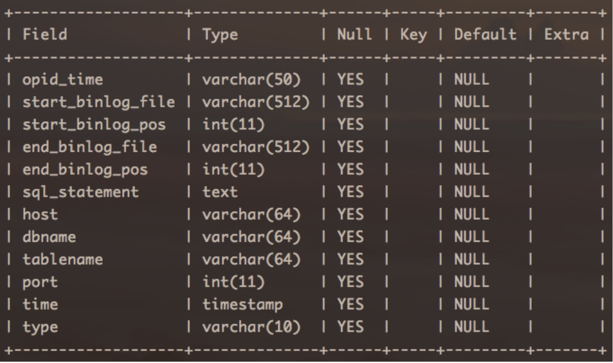
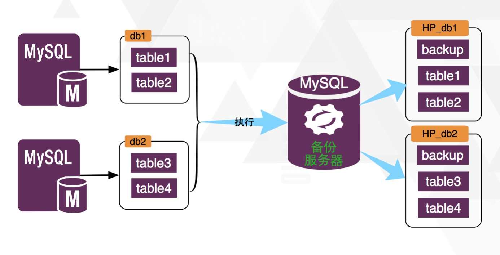

#Inception 备份功能说明
上面已经提到，Inception在做DML操作时，具有备份功能，它会将所有当前语句修改的行备份下来，存储到一个指定的库中，这些库的指定需要通过几个参数，它们分别是：

* `inception_remote_backup_host //远程备份库的host`
* `inception_remote_backup_port //远程备份库的port`
* `inception_remote_system_user //远程备份库的一个用户`  
* `inception_remote_system_password //上面用户的密码`  

这些参数可以直接在命令行中指定，也可以用**--defaults-file**指定一个**my.cnf**文件，一经指定，再不能更改，除非将服务器关闭，修改之后再次启动。文件中指定这几个参数的值，用法与mysql是相同的。
另外：Inception 是默认开备份功能的，为了使备份成为一个可选功能，增加一个是不是备份的参数**--disable-remote-backup**(在前面<<**Inception支持选项及意义**>>一章中已经介绍过)，如果开启则不做备份操作，都是直接执行，另外还有一点，执行时被影响的表如果没有主键的话，就不会做备份了，这样更简单并且备份时间及数据都会少一点，不然回滚语句的WHERE条件就会将所有列写进去，这样会影响性能且没有太大意义，所以在WHERE条件中，只需要主键即可。

通过上面参数设置的Inception备份用户必须要具备下面的权限才能成功备份的，包括：CREATE、INSERT。CREATE权限用于创建表或者库的，INSERT权限用于插入备份数据的，其它的权限不需要（也许是暂时的）。

备份数据在备份机器的存储，是与线上被修改库一对一的。但因为机器的多（线上机器有很多）对一（备份机器只有一台），所以为了防止库名的冲突，备份机器的库名组成是由线上机器的 IP 地址的点换成下划线，再加上端口号，再加上库名三部分，这三部分也是通过下划线连接起来的。例如：`192_168_1_1_3310_inceptiondb`，下面用 inceptiondb 举例为线上库名。

针对一个备份库，里面的表与对应线上表都是一一对应的，也就是说线上库inceptiondb中有什么表，在备份库`192_168_1_1_3310_inceptiondb`中就有什么表，表名也完全相同，不同的只是表中的列不同而已，它是用来存储所有对这个表修改的回滚语句的, 对应的表包括的列主要有下面两个：  
**`rollback_statement text`**：这个列存储的是针对当前这个表的某一行被修改后，生成的这行修改的回滚语句。因为 binlog 是 ROW 模式的，所以不管是什么语句，产生的回滚语句都是针对一行的，同时有可能一条语句的修改影响了多行，那么这里就会有多个回滚语句，但对应的是同一个 SQL 语句。对应关于通过下面的列来关联起来。  
**`opid_time varchar(50)`**：这个列存储的是的被执行的 SQL 语句在执行时的一个序列号，这个序列号由三部分组成：timestamp(int 值，是语句被执行的时间点)，线上服务器执行时所产生的 thread_id，当前这条语句在所有被执行的语句块中的一个序号。产生结果类似下面的样子：**1413347135_136_3**，针对同一个语句影响多行的情况，那么所产生的多行数据中，这个列的值都是相同的，这样就可以找到一条语句对应的所有被影响数据的回滚语句。  

除了与原库中的表一一对应之外，每个备份库中还有另外一个表：**$\_$Inception_backup_information$\_$**，这就是表名，非常难看，主要是为了防止与原线上库中的表名发生冲突。这个表是用来存储所有对当前库操作的操作记录的，它是公用的，对线上这个库的所有表操作记录都存储在这里面，这个表的结构如下：


而线上库表结果与备份库表结构的对应关系是：


#各个列的解释：

---------------
**opid_time**：这个列其实与上面备份表中的列 `opid_time` 是对应的，这里面存储的每一条记录对应语句块中被执行的一条 SQL 语句，opid_time 就是根据这条语句所生成的，那么一条语句有可能产生多行的影响，那么上面回滚语句表中的多行或者一行对应这个公共表的一行，这样就对上了。  
**start_binlog_file**：这个列从名字就可以看出，表示的是执行这条语句前 binlog 所在位置的文件名，当然这个值不一定准确，因为这是在执行语句前通过**show master status;**语句来获取的，那么在数据库并发比较高的话，这个值一般都不是准确的当前语句的Binlog开始位置，这个位置只能是这个语句产生的Binlog前面某个位置，同理下面三个位置信息也是一样。  
**start_binlog_pos**：这个列与上面的列对应，表示的是上面指定文件的位置信息。    
**end_binlog_file**：这个列表示的是执行当前语句之后，binlog 所在的文件名。  
**end_binlog_pos**：这个列与上面的列对应，它表示执行完成之后，binlog 在文件end_binlog_file中的偏移位置。  
**sql_statement**：这个列存储的是当前这个被执行的SQL 语句。  
**host**：表示在什么地址执行了这条语句。  
**dbname**：在哪个库中执行了这个语句。  
**tablename**：表示当前语句影响的表的表名。可以通过这个名字来对应到备份表名。  
**port**：与 host 对应，表示执行时数据库的端口是什么。  
**time**：表示当前语句的执行时间。  
**type**：表示操作类型，现在只支持INSERT、UPDATE、DELETE、CREATEDB、CREATETABLE、ALTERTABLE、DROPTABLE等类型。  

-------
针对现在备份及回滚的实现方案，如果已经知道一个语句的执行序列，想拿到这个语句的回滚语句，要执行的 SQL 语句为：  
````
select rollback_statement from 192_168_1_1_3310_inceptiondb.inception_test 
where opid_time =‘1413347135_136_3’;
````
上面语句查出来的只是针对一个语句块中某一条语句的回滚语句，但是如果想要得到整个语句块的回滚语句，还需要在这基础上做二次开发，针对每条语句的回滚（包括多条回滚语句）语句的前后，加上事务，保证这个回滚是原子的，并且按照执行结果的最后一个列的倒序将回滚语句排序，这样查出来的就是完整的回滚语句。

关于 DDL 的回滚，其实是很难做得完美，因为涉及到数据的大批量更改，并且 binlog 也是语句模式的，所以很难处理，但在 Inception 中采取的策略是只处理定义，不处理数据。现在 DDL 操作的回滚只包括 CREATE TABLE 、ALTER TABLE、DROP TABLE，其它类型的操作不支持，并且也没有太大意义，在实际使用中如果有需求再考虑如何实现。

每条 DDL 语句算是一个操作，同样的，这个操作也会存储在表**$\_$Inception_backup_information$\_$**中，关于 binlog 的一些列没有实际意义，对应的 opid_time 与 DML 是相同的，而同时在被操作表中，存储了回滚语句，其中的列 opid_time与上面表中的这个列关联。一个 DDL 操作（不管其中做了多少事），对应的回滚语句也是一条语句，例如：
原来的表是这样的：  
````
CREATE TABLE myinfo (
  id int(11) NOT NULL AUTO_INCREMENT COMMENT 'id',
  name varchar(10) NOT NULL DEFAULT 'baabb' COMMENT 'agedddd',
  age2 int(11) NOT NULL COMMENT 'agddd',
  age int(11) NOT NULL COMMENT 'age',
  PRIMARY KEY (id),
  KEY idx_name (id,name)
) ENGINE=InnoDB AUTO_INCREMENT=2150 DEFAULT CHARSET=utf8 COMMENT=’t’;
````

要执行的 alter 表语句为：  
````
alter table myinfo 
rename to myinfo1, 
add column age3 int not null comment 'age', 
add index idx_age2(age2), 
drop column age;
````  
那么产生的回滚语句为：  
````
ALTER TABLE inception.myinfo1 
DROP COLUMN age3,
DROP INDEX idx_age2,
ADD COLUMN age int(11) NOT NULL COMMENT 'age',
RENAME TO inception.myinfo;
````
