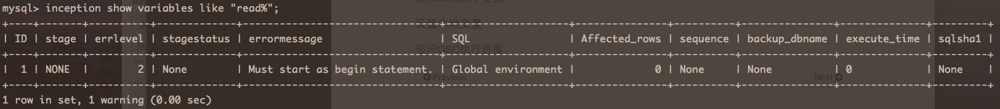
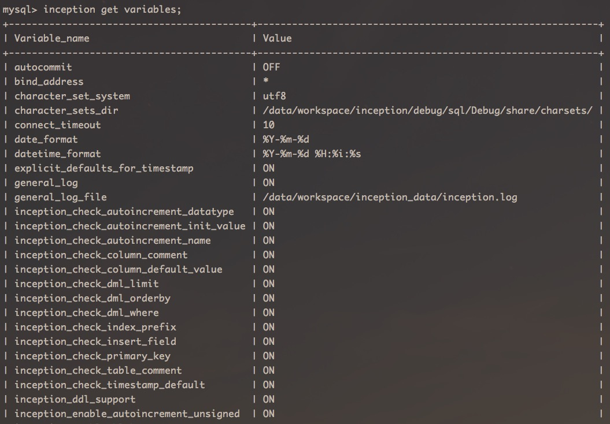
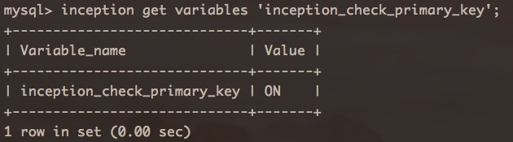
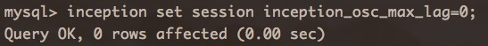
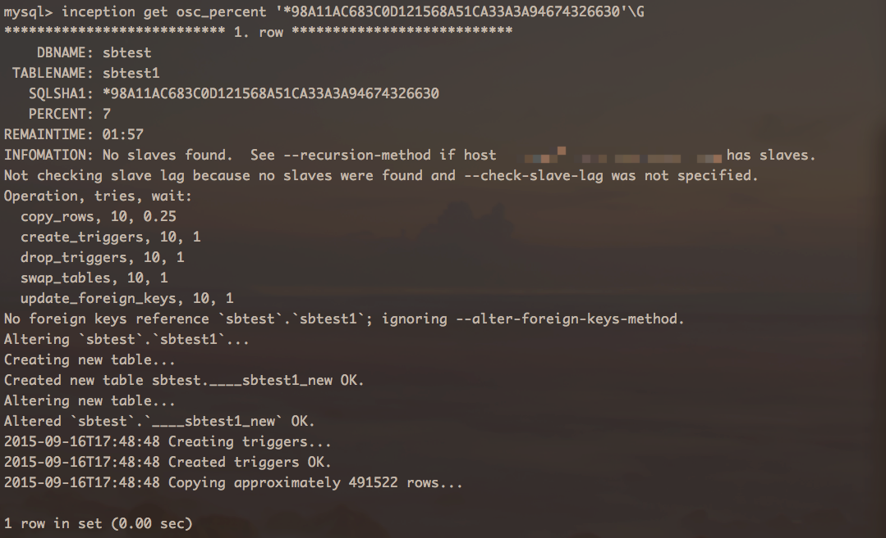
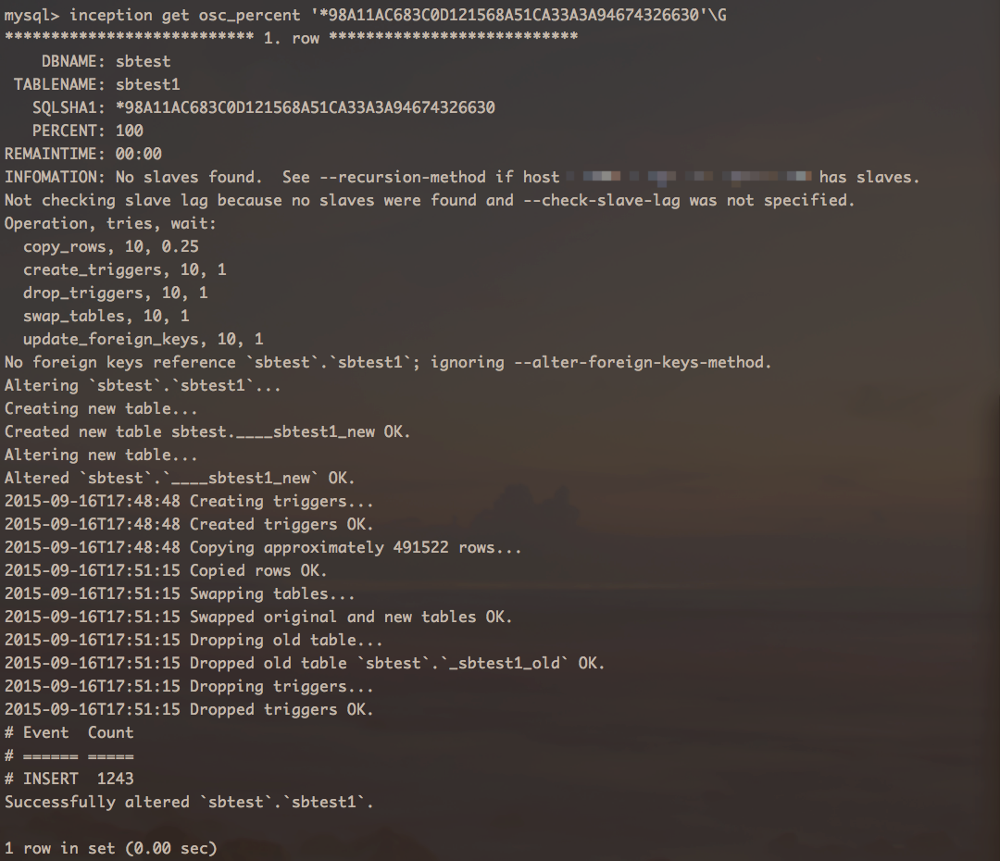
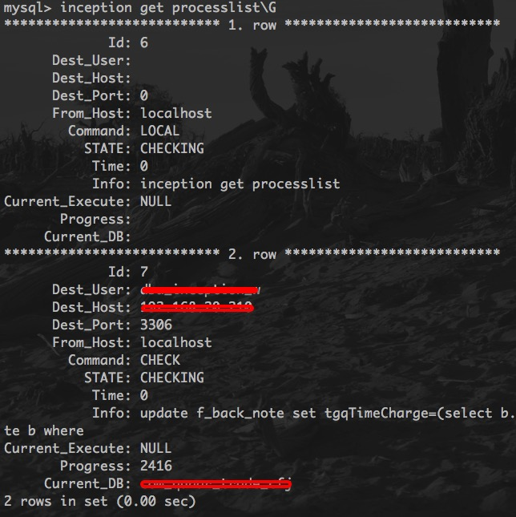

#Inception命令集语句
Inception命令是一个Inception所支持的一系列命令集，为了与原MySQL的命令区分，在命令前面使用Inception这个新的关键字。

这个命令集包括的功能有：打印线上服务器的一些信息，支持所有show命令，只要在原来show命令前面加上inception即可，返回的结果集放在上面所述结果集的SQL列中，前面是当前执行的inception命令，以冒号分隔，后面接着是执行show命令得到的结果集，每行以换行符分隔，一行中的不同列的数据，以竖线“|”分隔。此外还包括上面设置或查看相关参数的三个命令，这三个命令只能通过MySQL客户端或者编程直接执行，而不需要加上数据源、标记语句等信息。因为它是对Inception本身进行操作的。

下面列举一下共包括哪几类：
###显示远程变量  
这种情况，语法为`inception {MySQL支持的原生的show命令};`，比如
````
inception show tables;
inception show variables like "%read_only%";
````
其实这个命令就是用来方便得通过Inception工具来查看线上的某些状态或者变量等信息的，返回的结果会放在后面将要介绍的<<**Inception结果集**>>中所说的结果集的SQL列中的。具体输出格式是，最前面还是输出执行的inception命令，然后以冒号分隔，冒号后面接着是执行show命令得到的结果集，每行以换行符分隔，一行中的不同列的数据，以竖线“|”分隔。
比如对于命令  
````
/*--user=zhufeng;--password=xxxxxxxxxxx;--host=xxxxxxxxxx;
--enable-check;--port=3456;*/  
inception_magic_start;  
use mysql;  
inception show variables like "read%";
inception_magic_commit;
````
返回结果如下：  
````
qunar show variables like "read%":
		
read_buffer_size | 33554432
		
read_only | OFF
		
read_rnd_buffer_size | 262144
````
**注意**：因为查看远程变量，是需要连到远程数据库服务器的，所以执行时还是必须要加上前面的数据源信息的，不然在MySQL客户只支持这个语句会报错。

这个就是在提醒，必须要放在`inception_magic_start`及`inception_magic_commit`语句中才能执行。

###显示本地全部变量  
显示本地全部变量，就是查看Inception本身所有参数的值，语法非常简单：
````
inception get variables;
````
输出就是所有的变量，下图所示为部分变量：

**注意**，这个命令只显示Inception本身的一些参数变量的值，那么是不需要数据源信息的，所以它是可以直接在MySQL客户端执行的。
###显示本地某个变量
显示本地某个变量，和上面唯一的区别是，这只显示一个变量的值，而上面是显示全部，语法：
````
inception get variables 'variable_name';
````
下面是图例：


**注意**，这个命令只显示Inception本身的一些参数变量的值，那么是不需要数据源信息的，所以它是可以直接在MySQL客户端执行的，而如果放在数据源信息中执行的话，这样的语句会被忽略，不会做任何处理。
###设置本地变量  
Inception不仅可以查看它的参数值，还可以通过语句动态设置某个参数的值，因为Inception的参数（除部分OSC参数，具体参见<<**Inception所支持的参数变量**>>）是全局的，并且不是会话级别的，所以它是设置之后马上生效的，而有些OSC的参数是会话的，则只影响当前执行的连接。语法为：
````
inception set [session] variables_name=value;
````
**注意**，这个命令只显示Inception本身的一些参数变量的值，那么是不需要数据源信息的，所以它是可以直接在MySQL客户端执行的，而如果放在数据源信息中执行的话，这样的语句会被忽略，不会做任何处理。
下面是图例：

###显示OSC执行进度  
这个语句的作用是，当某一个ALTER TABLE语句正在通过Inception使用OSC执行时，可以通过这个语句来查询执行的进度度信息，语法：
````
inception get osc_percent '当前执行的SQL语句以及一些基本信息生成的SHA1哈希值';
````
具体的细节会在后面专门的一章<<**Inception 对OSC的支持**>>中讲述，这里只看一下图例：


上面是正在做的，而如果语句块中有多个修改表的操作，则前面的会看到执行完成的进度信息：



###查看当前processlist
inception还可以查看当前正在执行的所有线程信息，语法为：
````
inception get processlist;
````

当前命令执行之后，返回的结果信息如上图所示，每一个列介绍如下：

1. id:一个简单的计数。
2. dest_user:表示当前执行语句访问数据库时所用的用户名。
3. dest_host:表示当前执行语句要访问的数据库地址。
4. dest_port:表示当前执行语句要访问的数据库的端口。
5. from_host:表示当前执行语句是从机器上发起的。
6. command:表示当前执行的是什么操作，包括CHECK（简单审核），EXECUTE（执行），SPLIT（拆分），PRINT（打印计划树），LOCAL（本地命令）。
7. state:表示在当前命令下，执行的状态是什么，状态包括INIT（初始阶段），CHECKING（正在审核），EXECUTING（正在执行），DEINIT（退出），BACKUP（正在备份）。
8. time:表示当前语句执行所用时间。
9. info:显示当前正在执行的语句。


