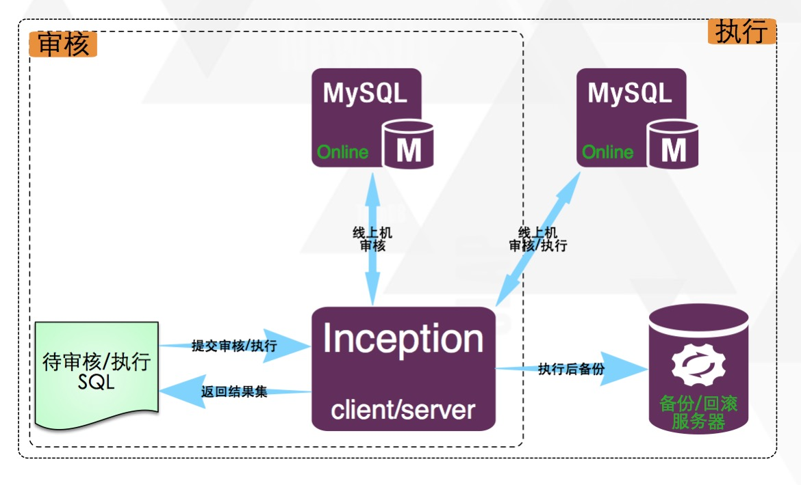

#总述
Inception是集审核、执行、回滚于一体的一个自动化运维系统，它是根据MySQL代码修改过来的，用它可以很明确的，详细的，准确的审核MySQL的SQL语句，它的工作模式和MySQL完全相同，可以直接使用MySQL客户端来连接，但不需要验证权限，它相对应用程序（上层审核流程系统等）而言，是一个服务器，在连接时需要指定服务器地址及Inception服务器的端口即可，而它相对要审核或执行的语句所对应的线上MySQL服务器来说，是一个客户端，它在内部需要实时的连接数据库服务器来获取所需要的信息，或者直接在在线上执行相应的语句及获取binlog等，Inception就是一个中间性质的服务。图1.1所示为Inception的架构。

Inception提供的功能很丰富，首先，它可以对提交的所有语句的语法分析，如果语法有问题，都会将相应的错误信息返回给审核者。
还提供语义分析，当一个表，库，列等信息不正确或者不符合规范的时候报错，或者使用了一个不存在的对象时报错等等。
还提供了很多针对SQL规范性约束的功能，这些DBA都是可以通过系统参数来配置的。
更高级的功能是，可以辅助DBA分析一条查询语句的性能，如果没有使用索引或者某些原因导致查询很慢，都可以检查。

还提供SQL语句的执行功能，可执行的语句类型包括常用的DML及DDL语句及truncate table等操作。
Inception 在执行 DML 时还提供生成回滚语句的功能，对应的操作记录及回滚语句会被存储在备份机器上面，备份机器通过配置Inception参数来指定。

