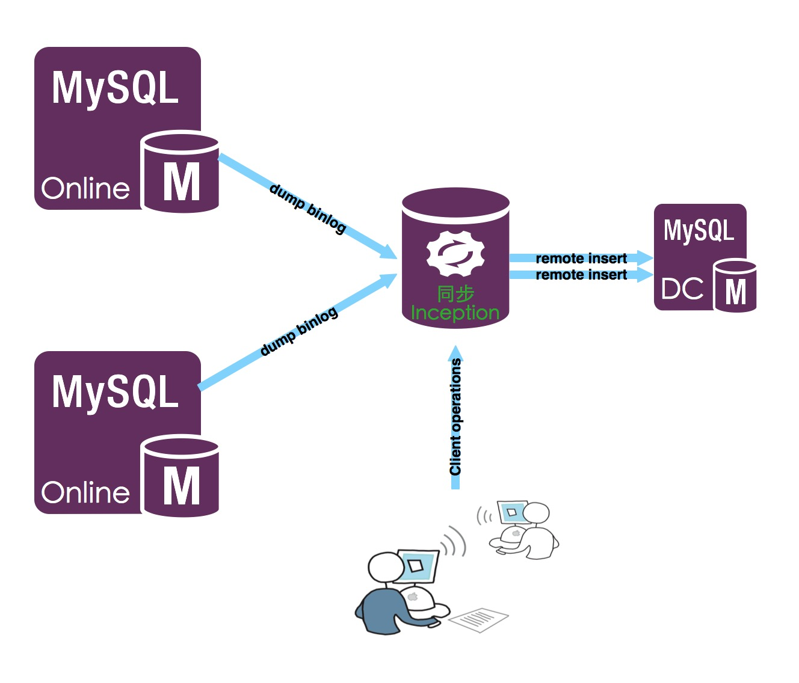
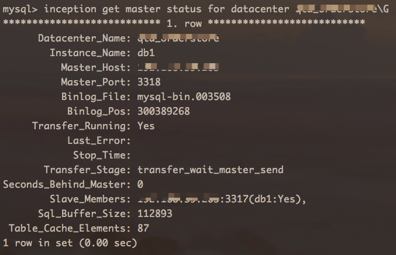
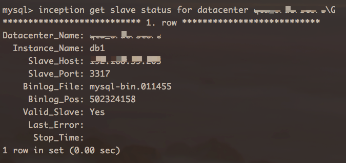
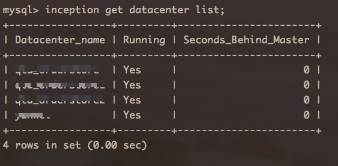
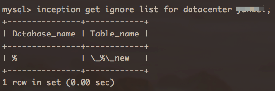
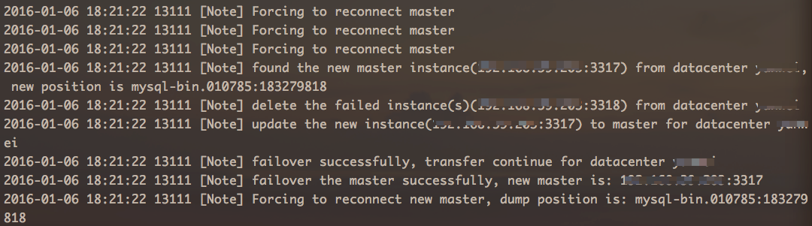

#Inception Gate运维手册
##背景

-----------------
Inception Gate是去哪儿网DBA部门开发的一款专门用来解决MySQL数据库异构数据实时同步问题的工具，目前，Qunar有两种这方面的需求：

1. 对数据库表的更新做异构化，也就是将上层数据库表结构及存储方式不能满足应用需求，需要转换、数据清洗及提取等，存储到另一种表结构中，这种存储方式更适合应用程序访问计算等。
2. 针对一些统计业务，每天都需要对某些表做统计，一般是在hadoop中计算，基于目前的方案，每天都需要大量的对MySQL数据库做全量数据的查询，先存储到hadoop中，然后才能计算，这样既浪费了很多时间，又对业务数据库产生影响，更重要的是，在数据库表日益增长的同时，每天查一次全量已经完全不能满足需求，增量又很难获取到，所以这就需要有一款异构实时数据同步的工具来解决这样的问题，这样统计可以随时进行，同时不会对业务数据库产生影响，完美解决问题。

##架构介绍

-----------------

Inception Gate的实现方式和MySQL数据库主从是同一个道理，Inception Gate会伪装成一个从库，从主库上面dump指定的binlog，Inception Gate收到之后，将其解析出来，直接在线转换成为一种更通用的，其它程序也能解析的Json格式，然后再存储到MySQL中，这个MySQL就是上图中所示的DC（datacenter）。

Inception Gate写入DC的方式是远程插入，是做为DC的客户端插入进去的。这种情况下，开发同学，只需要关注DC数据库即可，查出来的数据，都是增量的更新，其需要解析Json，然后应用到对应的统计库或者异构库中，即可实现数据库的异构实时同步，不过完全实时是不可能的，只需要保证Inception Gate在复制时没有延迟，同时应用程序读取DC的数据尽可能的快就好。

在上面复制架构中，每一个复制，都是一个单独并且完全独立的通道，但是不同的通道，可以对应同一个数据库实例，那么在每新建一个通道时，都需要给对应的通道起一个名字，这个名字指的就是这个通道对应的DC名，在这个数据库实例中，其实就是一个数据库名字，那么多个通道时，这个数据库实例中，就会有多个数据库，Incpetion Gate会将所有拿到的Binlog解析后存储到各自对应的DC中。

##使用模式

-----------------
Inception Gate是在Inception的基础上，实现的一个新的用来数据实时异构的工具，在运行模式、使用方式上具有异曲同工之妙的，之前Incpeiton已经支持了很多`inception etc. `之类的命令了，那么Inception Gate更是延序了这个特点，还是通过MySQL客气端，对Inception服务器做相应的操作，来实现数据的复制。

操作方式，实际上和操作MySQL服务器是一模一样的，只是语句有所不同，Inception Gate是通过自己定义的伪SQL语句来访问，操作Inception服务器的，与MySQL服务器唯一的区别是，MySQL服务器本地是存储数据的，而Inception Gate服务器，本地是不存储的，它是轻量级的服务，它的数据是存储在一个与之一一对应的叫做“datacenter(DC)”的，这是一个普通的MySQL实例，在Incpeiton Gate启动之前，就需要通过配置参数配置好的，启动之后，不能修改，在使用时，所有的复制数据集都存储在这里面。

##如何使用

-----------------
###登录Incpetion Gate服务器
Inception（Gate）服务器，和MySQL协议是兼容的，所以完全可以用MySQL客户端来直接连接Inception服务器，指定其host、PORT即可连接，Inception没有权限验证的，所以用户名密码是可以不指定的，或者可以随便指定，而如果想要限制Inception的访问，可以使用bind_address参数来指定。
登录命令如下：
````
mysql -udontcareme -pdontcareme -h127.0.0.1 -A -P9998
````

###创建一个datacenter
语法：
````
create datacenter {dc_name};
````

执行上面的命令之后，可以去DC实例上面看，会多了一个数据库，名字为"dc_name"，在这个数据库下面，多了下面几个表：
````
instances
master_positions
slave_positions
transfer_data
transfer_filter
transfer_sequence
````

下面分别介绍每一个表的结构及作用：

####instances
这个表，用来存储这个datacenter中，要复制的主节点与从节点的配置信息，表结构如下：
````
CREATE TABLE `instances` (
  `id` int(10) unsigned NOT NULL AUTO_INCREMENT,
  `instance_name` varchar(64) DEFAULT NULL COMMENT 'instance name',
  `instance_role` varchar(64) DEFAULT NULL COMMENT 'instance role, include master and slave ',
  `instance_ip` varchar(64) DEFAULT NULL COMMENT 'instance ip',
  `instance_port` int(11) DEFAULT NULL COMMENT 'instance port',
  `binlog_file` varchar(64) DEFAULT NULL COMMENT 'binlog file name',
  `binlog_position` int(11) DEFAULT NULL COMMENT 'binlog file position',
  PRIMARY KEY (`id`)
) ENGINE=InnoDB AUTO_INCREMENT=4 DEFAULT CHARSET=utf8 COMMENT='transfer instance set'
````
* id：简单的自增列而已
* instance_name：创建时，给自增列起的一个名字，表中唯一，在创建时会检查唯一性。
* instance_role：表示当前节点，在复制时，承担的是Master角色还是Slave角色，如果是Master，则Inception Gate会从这个节点取Binlog，而如果是Slave，则会在复制过程中取其show master status;位置信息，以便实现在Master挂了之后，自动切换到Slave继续做复制。
* instance_ip：表示当前节点对应的数据库IP地址。
* instance_port：表示当前节点对应的数据库端口。
* binlog_file：表示当前节点，在第一次开始复制时的位置，即起始位置，这个需要DBA手动通过相应命令（后面会一一介绍）去设置，如果不设置的话，Inception Gate会从对应的数据库实例上面取当前show master status;位置开始复制，或者如果之前已经复制过，则会从上次结束位置继续复制。
* binlog_position：上面已经介绍过。

####master_positions
这个表，是用来存储在复制过程中，Binlog以事务为单位的结束位置，或者是一个开始位置，Binlog是以事务为一个组的，这里只存储一个组的开始/结束位置，为了记录复制的合法位置，因为除此之外，其它的位置都是不完整或者不可解析的。并且上面已经提到，如果之前已经复制过数据，则在下次再开始时，会从上次复制结束的位置开始，那么就是从这里来取这个位置的。
````
CREATE TABLE `master_positions` (
  `id` bigint(20) unsigned NOT NULL COMMENT 'id but not auto increment',
  `tid` bigint(20) unsigned NOT NULL COMMENT 'transaction id',
  `create_time` timestamp NOT NULL DEFAULT CURRENT_TIMESTAMP COMMENT '
                the create time of event ',
  `binlog_file` varchar(64) DEFAULT NULL COMMENT 'binlog file name',
  `binlog_position` int(11) DEFAULT NULL COMMENT 'binlog file position',
  `datacenter_epoch` varchar(64) NOT NULL COMMENT 'datacenter_epoch',
  `thread_sequence` varchar(64) NOT NULL COMMENT 'thread_sequence',
  PRIMARY KEY (`datacenter_epoch`,`thread_sequence`)
) ENGINE=InnoDB DEFAULT CHARSET=utf8 COMMENT='transfer binlog commit positions'
````
* id：这是一个自增ID，但非MySQL的auto_increment id，这个ID是在Inception Gate内部维护的datacenter级别的自增ID，是通过表transfer_sequence来做的，每次取id时，都会检查当前id模inception_transfer_event_sequence_sync（一个新的参数，后面会统一介绍）为0的时候，就会更新一次transfer_sequence表的值为当前值加上inception_transfer_event_sequence_sync值。而取这个id是在分析到每一个binlog事件的时候做的，那么这样就可以保证了事件的顺序与ID的顺序是一致的，从而插入到DC中可以保证也是顺序的。如果以后升级Inception Gate为多线程插入DC时，可以保证数据的一致性。
* tid：这也是一个自增的ID值，与上面的不同之处在于，这个是每分析一个事务，自增1，那么这个TID与上面的ID配合起来，做为主键，就可以完全保证Binlog的顺序性，同时，更为重要的是，这两个ID的组合也是在应用程序使用时的一个游标标识值，以此来识别当前Binlog已经读到什么位置了，这两个ID需要开发自己来维护。
* create_time：这个列的值表示的是当前事件在主库执行的时间值，就是每个事件中存储的时间戳。
* binlog_file：表示当前事件Binlog的位置，这也是在复制中断之后，再次开始时默认的开始位置。
* binlog_position：同上。

####slave_positions
这个表，存储的是在instance中所记录的所有slave节点，在Master节点上分析到一个事务的结束位置时，会取一次Slave的unix_timestamp及show master status;位置，这个信息会存储到这个表中，这样是为了HA着想的，如果Master挂了，则会通过挂的时候，Binlog的时间，与这个表中的unix_timestamp值对比，只要取到比Binlog时间小的一个最大位置即可，切换之后，会从这个位置开始继续复制。
````
CREATE TABLE `slave_positions` (
  `id` bigint(20) unsigned NOT NULL AUTO_INCREMENT,
  `create_time` timestamp NOT NULL DEFAULT CURRENT_TIMESTAMP COMMENT 'the create time of event ',
  `instance_ip` varchar(64) DEFAULT NULL COMMENT 'instance ip',
  `instance_port` int(11) DEFAULT NULL COMMENT 'instance port',
  `binlog_file` varchar(64) DEFAULT NULL COMMENT 'binlog file name',
  `binlog_position` int(11) DEFAULT NULL COMMENT 'binlog file position',
  PRIMARY KEY (`id`),
  KEY `idx_create_time` (`create_time`)
) ENGINE=InnoDB AUTO_INCREMENT=25142904 DEFAULT CHARSET=utf8 COMMENT='transfer binlog commit positions'
````

* id：一个自增ID而已。
* create_time：上面说到的从Slave取回来的unix_timestamp值。
* instance_ip：Slave对应的IP地址。
* instance_port：Slave对应的端口。
* binlog_file：通过show master status取回来的位置。
* binlog_position：同上。

####transfer_data
这个表，是用来真正的存储将Binlog翻译之后的数据的，直接看表结构：
````
CREATE TABLE `transfer_data` (
  `id` bigint(20) unsigned NOT NULL COMMENT 'id but not auto increment',
  `tid` bigint(20) unsigned NOT NULL COMMENT 'transaction id',
  `dbname` varchar(64) DEFAULT NULL COMMENT 'dbname',
  `tablename` varchar(64) DEFAULT NULL COMMENT 'tablename',
  `create_time` timestamp NOT NULL DEFAULT CURRENT_TIMESTAMP COMMENT 'the create time of event ',
  `instance_name` varchar(64) DEFAULT NULL COMMENT 'the source instance of this event',
  `binlog_hash` varchar(64) DEFAULT NULL COMMENT 'binlog_hash, use to distinct',
  `optype` varchar(64) DEFAULT NULL COMMENT 'operation type, include insert, update...',
  `data` longtext COMMENT 'binlog transfer data, format json',
  PRIMARY KEY (`id`,`tid`),
  UNIQUE KEY `uniq_binlog_hash` (`binlog_hash`),
  KEY `idx_dbtablename` (`dbname`,`tablename`),
  KEY `idx_create_time` (`create_time`)
) ENGINE=InnoDB DEFAULT CHARSET=utf8mb4 COMMENT='binlog transfer data'
````
* ID，这个列存储的是一个序号，但不是MySQL的自增ID，是Inception Gate自己维护的一个自增序号，每读一个Binlog事务，序号就加1，因为每一个事务是一个Binlog的原子单元，Inception Gate在存储时，也是以事件为单位的。维护一个这样的ID，主要是为了与另一个列TID一起来做联系主键使用的，因为Binlog在文件中是有序的，而插入到transfer_data中之后（如果是并发插入的话），如果没有这个联系主键的话，很难保证实际的顺序，同时这也是为开发同学提供的一个自己维护的游标信息，在具体使用过程中，开发同学需要自己来维护这两个ID值，这样才能知道异构数据已经同步到什么位置了。
* TID，上面已经介绍了一部分，这个值是与Binlog中的事务相关的，每次开始一个新事务，这个值就加1，也就是说，在transfer_data表中，不同数据中，如果TID的值相同的话，说明这些变更是同一个事务产生的，但是ID值肯定是不同的。
* DBNAME，这个列存储的是当前变更发生在哪个库中，与另一个列TABLENAME一起，用来表示当前变更是针对哪一个表的，因为ROW模式Binlog中，每一个事件只能是针对一个表的操作，所以想要知道某一个表发生了哪些变化，或者统计应用如果只关注某些表，或者某一个表的话，只需要不断的查询这些表对应的变更即可。同时表transfer_data中，已经建了这两个列的联系索引，性能应该是不成问题的。
* TABLENAME：上面已经介绍过了。
* CREATE_TIME：这个列，是用来存储，当前Binlog事件实际在主库上面执行的时间值，这个时间，应用程序也可以用来检查当前处理是不是有延迟，或者延迟多少等。
* INSTANCE_NAME：这个列用来存储当前DC是从哪个实例上面获取的Binlog，存储格式是IP加端口，用“：”分隔。应用程序如果关注切换的话，如果发现这个值变了，则说明切换了，那么此时有可能存在数据冗余处理，因为Inception Gate在处理切换时，不可能精确的找到原来读取Binlog的数据库实例失败的位置与Inception Gate设置的从节点的位置，只能是通过CREATE_TIME的值来确认不丢Binlog即可，找到比CREATE_TIME值小的最大的值，然后从其对应的Binlog位置开始继续复制即可。（高可用自动切换的实现方式是，在配置DC复制时，会同时配置一个备用节点，在复制过程中，Inception Gate会不断的取当前备用节点的unix_timestamp及show master status;，当发生切换时，通过create_time与unix_timestamp的对比，找到对应的show master status值）。
* OPTYPE：这个列存储当前事件的操作类型，目前包括INSERT、UPDATE、DELETE、TRUNCATE、ALTERTABLE、RENAME、CREATETABLE。应用程序需要哪一种变更，就处理哪一种，否则可以直接忽略或者不查即可。
* DATA，这个列，就是这个表的主角了，这里面存储的就是某一个Binlog事件，在翻译之后的信息，它的类型为大字段，内容格式为Json的。

####transfer_checkpoint
````
CREATE TABLE `transfer_checkpoint` (
  `id` bigint(20) unsigned NOT NULL COMMENT 'eid',
  `tid` bigint(20) unsigned NOT NULL COMMENT 'tid'
) ENGINE=InnoDB DEFAULT CHARSET=utf8 COMMENT='checkpoint sequence, 
                                    before which are all avialable'
````
因为Inception Gate转换线上Binlog，是多线程并发处理的，那么肯定存在一个问题，就是最新被处理的Binlog有可能是不完整的，存在空洞，因为线程通过操作系统内核调度时执行有先有后，最新执行的事务前面经常会存在还没有执行的事务，而此时最新的事务已经插入到DC中了，而没有执行的当然在DC中不会有，那么如果应用程序读的太快的话，就会导致有些数据读不到，因为应用程序已经认为读过的位置之前的事务都已经读取完毕了。那这样就导致了数据丢失的问题。

而这个表就是用来解决这个问题的，在DC中，没办法知道在什么位置之前所有的数据都是完整的，而Inception Gate是了如指掌的，所以通过这个表，来精确记录这个分界点的位置。

从表结构可以很明确的看到，只存储了两个id值，这两个id值就是对应transfer_data中的id值，只不过这个表告诉你，在transfer_data表中，所有小于这两个id值的数据，都是完整的，不会丢失数据，而大于这两个值的数据，则事务之间存在空洞的问题。而同时，这个表只会有一条记录。

简单而言，在应用程序使用过程中，只要把这个表中的id值记录为当前可以读取的最大位置即可。

####transfer_filter
这个表，是实现了Inception Gate的另一个功能，复制过滤功能，这里管理了复制白名单及黑名单信息，和MySQL复制的replicate_do_db及replicate_ignore_db类似，在这个表中，只要存储了do db的信息（白名单），那么黑名单信息失去了作用，因为只要有白名单，那么将会只复制白名单中的表，而如果不存在白名单信息的话，则在复制过程中，会忽略掉黑名单中的表信息，也就是遇到对这些表操作时，直接跳过即可。

````
CREATE TABLE `transfer_filter` (
  `db_name` varchar(64) NOT NULL DEFAULT '' COMMENT 'db name',
  `table_name` varchar(64) NOT NULL DEFAULT '' COMMENT 'table name',
  `type` varchar(64) NOT NULL DEFAULT '' COMMENT 'blacklist/whitelist,do or ignore',
  PRIMARY KEY (`db_name`,`table_name`,`type`)
) ENGINE=InnoDB DEFAULT CHARSET=utf8 COMMENT='use to filter the replicate'
````
* db_name：这个列存储的是白名单或者黑名单指定的库名，或者是MySQL Like的模式串，比如如果我只想执行或者跳过包含dba字符串的库，同时只想执行或者跳过以下划线开头，以_new结尾的表时，可以增加这样的信息：db_name：`%dba%`，table_name：`\_%\_new`即可实现。
* table_name：同上。
* type：这个列只有两个值，分别是"Do"和"Ignore"，表是的是白名单及黑名单。

####transfer_sequence
这个表就是上面提到的Inception Gate维护的自增ID的表，意义都已经清楚，下面看表结构：
````
CREATE TABLE `transfer_sequence` (
  `idname` varchar(64) DEFAULT NULL COMMENT 'id name',
  `sequence` bigint(20) unsigned NOT NULL COMMENT 'sequence'
) ENGINE=InnoDB DEFAULT CHARSET=utf8 COMMENT='sequence management'
````
* idname：存储的只有两个值，分别是："ID"和"TID"，分别表示是事件id还是事务id。
* sequence：表示的是，在Incepiton Gate中的当前datacenter中，当ID或者TID达到当前表中的值后，会自动更新为当前值加上一个参数配置的值，也就是为当前操作分配了一段空间，减少冲突。但也有可能会有空洞，但没关系。

###增加复制节点信息
语法：
````
inception add {master|slave} instance {instance_name} 
('{ip_address}', {instance_port}) 
for datacenter {dc_name};
````
这个语句可以实现的功能是，在上面创建好的datacenter上面，增加一个复制节点，但第一次，只能增加master节点，并且在一个DC库中，只能有一个master节点，否则会报错。

还有一点需要注意，加节点，不能在线动态加，需要在复制停止的状态下加，否则会报错。
###设置复制位置信息
语法：
````
inception set transfer position('{binlog_file}',{binlog_position}) 
for  datacenter {dc_name};
````
通过上面这个语句，可以在dc_name的datacenter中的Master节点上面设置复制位置信息，位置信息只有Master信息需要，其它Slave信息是不需要的，因为它们是在复制过程中动态获取并且记录的。

而在设置了之后，再次开始复制，或者首次开始复制，Inception Gate都会使用这个位置来做复制，而不会考虑其它位置信息。

还有一点需要注意，设置位置信息，不能在线动态设置，需要在复制停止的状态下，否则会报错。
###启动复制
语法：
````
inception start transfer for datacenter {dc_name} [with master_user '{replicate_user}' 
master_password '{replicate_password}'];
````
在设置好DC及复制主从节点之后，就可以start复制了，可以通过上面的语句来启动，需要注意的是，语句中的用户名密码需要在目标数据库上面有这个权限，权限需要包括REPLICATION_CLIENT，REPLICATION_SLAVE即可（不同版本，可能需求不同，具体如果除此之外其它权限，可以再自己加）。

另外，用户名密码是可选的，但这前提是之前已经开始复制了，并且没有做过RESET操作，也就是说当前这个DC在Inception Gate中的缓存中还存在，就可以不设置密码，但如果没有设置密码开始复制时，如果复制中断了，并且是报连不上的错误，那可能就需要指定了。

关于启动时，复制开始位置的选择，按照如下优先顺序来选择：

* Master节点上面设置的明确的Binlog位置，可以查看DC库中instance表中的信息，也可以通过下面查看状态命令来查看。
* 之前已经复制到的位置，这个要依赖于在Inception Gate中对当前DC的信息缓存，也就是通过查看状态信息中看到的位置，如果有就从这个位置开始，如果没有，就走下面的方式。
* 通过执行show master status;命令，来查看当前Master节点的最新位置，然后从这个位置开始复制。

###停止复制
语法：
````
inception stop transfer for datacenter {dc_name}
````
现在已经了解到，在对DC做维护时，有些操作是需要在复制停止的状态下进行的，所以此时就需要执行这个命令将复制停下来，与主从复制中的STOP SLAVE是一样的。

在STOP之后，之前的复制信息都会缓存在Inception Gate中，包括位置信息，用户名密码等，所以再开始的时候，就可以使用上面提到的简单语句来执行了。

###重置复制
语法：
````
inception {start|reset|stop|flush} transfer for datacenter {dc_name}
````
在当前复制无效的情况下，或者想要主动清除缓存时，可以执行这个命令，这个命令对将当前DC中主节点的位置信息置空，并且将其缓存信息从Incpetion Gate中清除。
但是，如果是想彻底将DC信息清空，并且要从一个新的位置（自动从当前位置）开始复制时，可能需要手动去DC库中truncate一下master_positions表的数据，不然再次开始时，还会从这个表中找到相应的位置。
如果想完全清空原来的复制信息，那还可以进一步手动将transfer_data表、slave_positions数据truncate掉。

###查看主节点复制状态
在复制过程中，复制的状态对于DBA来说，是至关重要的，或者中断了，是因为什么错误导致的，都是需要通过这个状态信息来查看的，那么Inception Gate提供了这样的命令：

语法：
````
inception get master status for datacenter {dc_name}
````


从图中可以很明显看得出来每一个列的信息，基本与show slave status\G是一致的，下面只简单介绍一下某几个：

* Binlog_File：表示的是当前复制到什么位置了，因为主从复制会将Binlog落地的，所以有两个位置，而Inception Gate取过来Binlog是直接分析入库的，不会落地的，所以只有一个位置信息。
* Slave_Members：记录的是当前从节点信息及死活状态，Yes表示正常，No表示已经出错，其实这里对于Slave，只是获取系统时间及show master status;，一般不会出错，大部分可能是连接不上，这里强调一点，Inception Gate默认认为开始复制时指定的帐号在主节点与从节点的权限是一样的。从节点没有单独的帐号。
* Sql_Buffer_Size：这个列是用来统计的，因为在Inception Gate内部是需要拼接SQL语句的，为了提高效率，这个拼接区是公用的，只会增大不会缩小，那么这里表示的是这个拼接区当前的大小，单位是字节。
* Table_Cache_Elements：Incepiton内部在处理表的问题上面，是有缓存的，在复制时，都会在首次使用到这个表时，才去服务器上面获取表信息，那么这个列表示的是，当前已经缓存了多少个表了，目前这个缓存区只会增长不会缩小，并且也没有大小设置。

###查看从节点复制状态
在查看主节时，显示了部分简单的从节点信息，但如果从节点真有总理了，则需要看看从节点的状态信息，此时可以通过下面的语句来查看：

语法：
````
inception get slave status for datacenter {dc_name}
````

上图显示的就是从节点状态信息，如果有多个从，则就显示是多行，但具体列信息的意义，这里就不做介绍了，一目了然。

###启动/关闭从节点
有时候，就想将某一个从节点做采集了（可能比较少），那么可以主动关闭，这个是可以在线操作的。
而如果，开始复制之后，发现从节点信息的获取是失败的（No），那在知道原因并且处理之后，需要主动去开启，此时就需要用到这个开启命令了。

需要注意的一点是，在复制开始之后，如果从节点获取失败（会得试三次）了，那么他就会被置为失败，再不开启，除非主动开启。

语法：
````
inception {stop|start} slave {instance_name} for datacenter {dc_name}
````
###查看所有datacenter
DBA肯定想在一上去某一个Inception Gate实例上面之后，看看当前实例承载着几个数据库的复制工作，就像是上去之后，首先来一个show databases;一样，那么Inception Gate也提供了这样的功能：

语法：
````
inception get datacenter list;
````


上图中所示的信息是一目了然的，不需要做过多介绍。

###设置白/黑名单
上面已经介绍过，Inception Gate支持复制过滤功能，而这些功能的运维是可以通过相应的命令来实现的，但前提是，这些设置需要在复制停止的过程中来设置的。

语法：
````
inception {add|drop} {do|ignore} table ('{db_name}', '{table_name}') 
for datacenter {dc_name} 
````
简单举例子如下：
````
incepiton add ignore table ('%', '\_%\_new') for datacenter dc_name;
````
这表示的是忽略所有库下面，表名以_开头，以_new结尾的表，其实这一般是OSC执行时给新表搬数据的表，这样就将其写入都忽略了。

这里如果设置的是通配符的话，直接使用MySQL中Like操作的通配规则即可。这样比较适合DBA的思维。

###查看白/黑名单
在设置之后，要想知道当前有哪些黑名单或者白名单信息，除了去DC上面`select * from transfer_filter;`之外，还可以通过下面命令来实现：
````
inception get {do|ignore} list for datacenter {dc_name} 
````
结果如下：



##过期数据的清除

-----------------
Inception Gate的模式是，从Master Dump Binlog过来分析组装之后，源源不断的向DC库中写入数据，那么时间长了，相当于是将所有Binlog又存储一份，这个数据库实例的大小那可是相当可观啊。

Incpetion Gate提供了一种自己删除数据的机制，只要复制在运行，那么它就会对应一个删除线程在慢慢的删数据，删除方式是根据每个表中（master_positions，slave_positions，transfer_data）的列create_time，只要是inception_transfer_binlog_expire_days天之前的数据，都批量删掉，每次删掉10000条。

参数inception_transfer_binlog_expire_days是可以设置的，默认值是7天。

##支持参数

-----------------
|参数名字                                 	 |可选参数        	 |默认值    	 |功能说明|  
|:-------------------------------------------------|:-----------------------|:---------------:|:-----------|
|inception_transfer_slave_sync              |1-4294967295|16 |这个参数用来设置多少个主库的Master事务才去取一次SLAVE位置信息，因为本身在Failover时，不可能做到无缝，只能保证不丢，都是会多出来的，为了提高效率，减少延迟，可以将这个值设置大一些，Inception Gate不会频繁去取Slave的位置时间信息，有一个不好之处就是，如果设置太大，会导致切换后，冗余数据会多一些。|  
|inception_transfer_binlog_expire_days|1-4294967295|7|这个参数用来设置复制的数据多少时间算过期，在这个天之前的数据，都会在后台自动删掉|
|inception_transfer_trx_sequence_sync|10-4294967295|1000|这个参数用来设置TID发号器的步长|
|inception_transfer_event_sequence_sync|100-4294967295|10000|这个参数用来设置ID发号器的步长|
|inception_transfer_server_id|2-4294967295|0|这个参数和MySQL中的server_id是一样的，在Inception Gate中必须要设置，同时不能与Master及Slave相同|
|inception_datacenter_host|无|0|Inception Gate对应的DC数据库实例地址|
|inception_datacenter_port|无|0|Inception Gate对应的DC数据库实例端口|
|inception_datacenter_user|无|0|Inception Gate对应的DC实例操作用户名|
|inception_datacenter_password|无|0|Inception Gate对应的DC实例操作用户密码|

-----------------

##Failover切换
如果DC上面配置了Master之外，还配置了Slave节点，Inception Gate会自动不断的取Slave的时间及复制位置信息，当Master失败之后，Incpetion Gate会根据最后一次成功的Master Binlog时间，去slave_positions中取出比这个时间值小的信息中，位置信息最大的位置，然后Incpetion Gate会从这个位置开始继续复制Binlog，插入到远程的DC中。

在切换过程中，instance表中的信息会被重构，会将原来的Master节点删掉，将新的Slave节点更新为Master，切换之后，老的信息就看不到了，只会在log_error指定的日志中，记录下切换的过程，一个例子如下面所示：



* 前面三行，是在连不上Master之后的三次重试操作。
* 第四行，说明了，已经找到了一个新的Master，包括IP端口以新的Binlog位置信息。
* 第五行，是说将原来的Master删掉了。
* 第六行，说明已经将原来的Slave信息更新为Master。
* 第七八行，说的是已经切换成功。
* 第九行，说明了，在切换之后，继续复制，连接新Master并发送了Dump请求。
* 正常复制，此时可以通过`inception get master status for datacenter dc_name`来查看状态。

-----------------

##技术细节

###表对象缓存

-----------------
* 问：Inception Gate这种工作模式，很容易出现这种半路复制的状态，比如我把某一张表删了，但开始复制的位置是在删表之前，那么Inception Gate去取这个表的信息时，发现这个表不在了，但Binlog在，这如何继续下去？

对于这个问题，其实在Inception Gate中是直接将其忽略的，这些Binlog就不做解析了。

* 问：继续上一个问题，假如没有那么极端，而是将表加了一列，或者删了一列等等，这种情况下，列数不对应，Inception Gate如何处理？

对于这个问题，其实在Inception Gate中是直接将其忽略的，这些Binlog就不做解析了。

* 问：继续上一个问题，如果没有删表，也没有增删列，而是改变了列的属性，Inception如果处理？

对于这样的问题，Inception Gate在解析到时，会判断表的列类型与Binlog中的实际类型是不是匹配，如果不匹配，则会以Binlog中的信息为准，去解析Binlog，所以这种情况不会有问题，正常执行即可。

* 在Inception Gate中，是如何处理DDL的？缓存中的对象会随之变化么？

好问题：答案是肯定的，但实现方式有点不同，当Incpetion Gate遇到在Binlog中的ALTER、RENAME语句时，会直接将缓存对象删掉，那么再次用到这个表时，直接从线上获取最新的即可，这样就保证了表结构与Binlog保持高度一致性，假设一开始有上面提到的删表，增删表，改列类型等情况，但最终，都是一致的，同时也不会再出现不一致的情况。这就是使用了缓存策略中的淘汰机制。

###白/黑名单匹配
Inception Gate支持设置白名单及黑名单，并且支持通配符的匹配，那么Inception Gate是如何去分析通配符并且匹配呢？

模式匹配是一个复杂的过程，有很多算法，并且性能也有好有坏，我自己再实现一个，可能很费劲，也可能会有错误，苦思之后，找到一个极其简单并且行之有效的方式来实现。

上面已经提到，Inception Gate会对每一个用到的表进行缓存，那么在首次使用到这个表时，可以通过这样的语句，来判断它是不是要忽略掉：
````
select count(*) from transfer_filter where new_cache_table_name like 
transfer_filter.table_name and new_cache_db_name like transfer_filter.db_name;
````
将这个复杂的问题交给了MySQL去做，白/黑名单成为了一个LIKE表达式中的模式，太简单了，准确高效。

##注意

* 对于一个表，如果在第一次加入到缓存时判断是Do或者Ignore，那么在STOP TRANSFER之前，这个表的这个属性是不会再改变的。
* 对于一个新表，如果在其加入之前，手动去修改transfer_filter表中的信息时，可以绕过Inception Gate，来实现增删白/黑名单的目的。
* 在运维过程中有任何问题，请联系DBA王竹峰。
