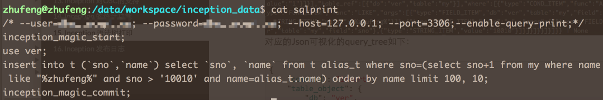
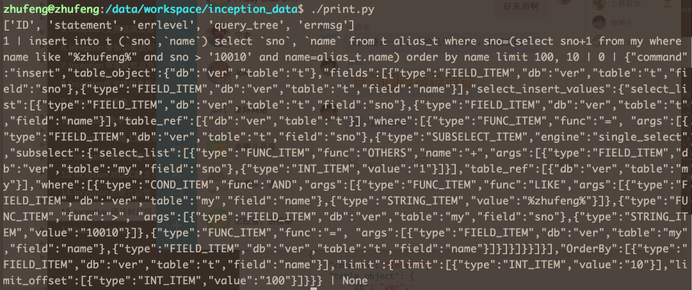

#Inception 语法树打印
目前，Inception已经支持大部分MySQL语句了，但是有一点不足之处是，规则都是固定的，虽然可以通过设置参数来修改是不是可以跳过这些检查，但除了检查语法错误之外，其它可配置的检查始终是一个固定在一个范围内的，如果想要新增一些检查项，过程可能比较慢长，所以想到在Inception内部，再集成一个格式化、结构化SQL语句的功能，这样的好处是，上层根据Inception返回的结构化的SQL语句，定义一些自己的规则，这样就可以满足更多人的需求了。

如果这是你的需求，请继续往下看。

##结果集信息

前面在介绍<<**Inception支持选项及意义**>>中已经讲过了，可以通过设置选项--enable-query-print来启用打印语法树的功能，同样的，它与其它enable开头的选项是互斥的，不能同时设置，开启之后，再连接Inception，执行返回的结果集是一个与拆分、审核及执行都不同的结果集，所包括的列如下：

1. ID：这个用来表示当前语句的一个序列值。
1. STATEMENT：这个列用来存储当前被分析的SQL语句。
1. ERRLEVEL：这个列用来存储当打印遇到问题时，错误的级别，与审核结果集中的ERRLEVEL意义相同。
1. QUERY_TREE：这个列就是对当前语句的分析结果，格式为JSON字符串。
1. ERRMSG：这个列与上面的ERRLEVEL对应，当出错时，这里存储分析过程中所有的错误信息，与审核结果集中的同名列意义相同。

##举例说明

举例说明才是最有说服力的： 针对SQL语句：
````
insert into t (sno,name) 
        select sno, name from t alias_t 
        where sno=(
                select sno+1 from my 
                where 
                name like "%zhufeng%" and 
                sno > '10010' and 
                name=alias_t.name
        ) 
        order by name 
        limit 100, 10;
````

执行时提交给Inception的语句如下： 


执行结果如下： 


注：使用到的print.py其实和之前<<**Inception使用方法**>>中介绍的脚本没什么两样，只是显示的结果集不同而已。

对应的Json可视化的query_tree如下：

````
{
    "command": "insert",
    "table_object": {
        "db": "ver",
        "table": "t"
    },
    "fields": [
        {
            "type": "FIELD_ITEM",
            "db": "ver",
            "table": "t",
            "field": "sno"
        },
        {
            "type": "FIELD_ITEM",
            "db": "ver",
            "table": "t",
            "field": "name"
        }
    ],
    "select_insert_values": {
        "select_list": [
            {
                "type": "FIELD_ITEM",
                "db": "ver",
                "table": "t",
                "field": "sno"
            },
            {
                "type": "FIELD_ITEM",
                "db": "ver",
                "table": "t",
                "field": "name"
            }
        ],
        "table_ref": [
            {
                "db": "ver",
                "table": "t"
            }
        ],
        "where": [
            {
                "type": "FUNC_ITEM",
                "func": "=",
                "args": [
                    {
                        "type": "FIELD_ITEM",
                        "db": "ver",
                        "table": "t",
                        "field": "sno"
                    },
                    {
                        "type": "SUBSELECT_ITEM",
                        "engine": "single_select",
                        "subselect": {
                            "select_list": [
                                {
                                    "type": "FUNC_ITEM",
                                    "func": "OTHERS",
                                    "name": "+",
                                    "args": [
                                        {
                                            "type": "FIELD_ITEM",
                                            "db": "ver",
                                            "table": "my",
                                            "field": "sno"
                                        },
                                        {
                                            "type": "INT_ITEM",
                                            "value": "1"
                                        }
                                    ]
                                }
                            ],
                            "table_ref": [
                                {
                                    "db": "ver",
                                    "table": "my"
                                }
                            ],
                            "where": [
                                {
                                    "type": "COND_ITEM",
                                    "func": "AND",
                                    "args": [
                                        {
                                            "type": "FUNC_ITEM",
                                            "func": "LIKE",
                                            "args": [
                                                {
                                                    "type": "FIELD_ITEM",
                                                    "db": "ver",
                                                    "table": "my",
                                                    "field": "name"
                                                },
                                                {
                                                    "type": "STRING_ITEM",
                                                    "value": "%zhufeng%"
                                                }
                                            ]
                                        },
                                        {
                                            "type": "FUNC_ITEM",
                                            "func": ">",
                                            "args": [
                                                {
                                                    "type": "FIELD_ITEM",
                                                    "db": "ver",
                                                    "table": "my",
                                                    "field": "sno"
                                                },
                                                {
                                                    "type": "STRING_ITEM",
                                                    "value": "10010"
                                                }
                                            ]
                                        },
                                        {
                                            "type": "FUNC_ITEM",
                                            "func": "=",
                                            "args": [
                                                {
                                                    "type": "FIELD_ITEM",
                                                    "db": "ver",
                                                    "table": "my",
                                                    "field": "name"
                                                },
                                                {
                                                    "type": "FIELD_ITEM",
                                                    "db": "ver",
                                                    "table": "t",
                                                    "field": "name"
                                                }
                                            ]
                                        }
                                    ]
                                }
                            ]
                        }
                    }
                ]
            }
        ],
        "OrderBy": [
            {
                "type": "FIELD_ITEM",
                "db": "ver",
                "table": "t",
                "field": "name"
            }
        ],
        "limit": {
            "limit": [
                {
                    "type": "INT_ITEM",
                    "value": "10"
                }
            ],
            "limit_offset": [
                {
                    "type": "INT_ITEM",
                    "value": "100"
                }
            ]
        }
    }
}
````

上面的SQL语句实际上没有任何意义，这里只是为了尽可能好的将每一类型的表达式打印出来而胡乱构造的。

可以看到，这个Json串很长，不过结构化之后，整个语句就非常清楚了，是什么语句类型，用到什么表，什么列，有没有ORDER BY等，都非常明确，分析语句再也不是难事儿了，使用程序对这个结构化的语句做分析，应该是很容易了，并且是非常准确的。

##标签定义
不过这里还是要简单讲一下语法树Json串中的一些标签：

1. command: 每个语句都是以command开头的，这个表示是什么语句类型，现在支持的有insert, update, delete, select这四种类型。
1. table_object: 表示当前语句对哪个表做的操作，这个只针对插入、删除操作的，比如是插入哪个表，删除哪个表。而更新操作在语法树中不太好确认哪些表被改了，所以这里没有明确拿出来，而是可以通过从更新列的信息中取到表信息，这也就是被更新的表。这是一个字典，里面包括的是一个，或者多个表信息，并且已经对应到其对应的数据库。
1. fields: 表示插入时语句中指定的要插入的列列表，如果没有指定，则没有这个信息。它是一个数组，包括了语句中所指定的所有列信息，每一个列是一个对列表达式的表示，包括数据库、表及列名，因为这是一个表达式，所以其表达式类型为FIELD_ITEM，后面会专门列出所有支持的表达式信息。
1. select_insert_values: 这个表示的是查询插入的查询部分，它是一个字典，里面包括了这个查询语句的所有元素，包括查询列、查询涉及的表、WHERE及ORDER BY等信息。
1. select_list: 表示当前查询语句（或者子查询）要查询的表达式信息，这里可以是列，也可以是其它计算出来的值，例子中就有select sno+1...这样的查询。
1. table_ref: 表示当前语句上下文中使用到的表信息，是一个数组，包括了所有的表，这里所谓的上下文，可以简单理解为，在一个子查询的可见范围内的所有表达式，都是属于同一个层次的，而如果比如一个列在当前上下文中找不到，可能就需要去父亲的上下文中找，那如果找到了，这种就算做是相关子查询，那么这种一个语句中有不同层级的查询存在时，就存在不同的上下文。在例子中也有相关反映。
1. where: 表示的就是查询表达式（包括查询、删除、更新及查询等）的语法树，因为WHERE语句其实就是一个表达式，只是有可能是多个表达式的逻辑运算而已。
1. OrderBy: 表示查询时使用到的排序列，是一个数组。
1. limit: 表示在查询时使用到的LIMIT信息，因为LIMIT是一个复合信息，包括了限制行数及开始位置等，所以会有limit及limit_offset，而limit_offset有可能没有，只有限制行数。
1. GroupBy: 表示查询时使用到的分组列，是一个数组。
1. Having: 表示查询时，使用到的Having表达式。
1. subselect: 如果使用到子查询时，则这个就用来表示这个子查询。它是一个字典。
1. many_values: 在查询语句中，如果插入的是值，而不是查询结果，则用这个来表示它的值列表，因为在MySQL中可以同时插入多个值，则这里有可能是多个。
1. values: 如果插入的是值时，这个用来表示一行的插入内容，这是一个数组，每个元素是一个列的表达式。这是many_values数组的一个元素。而如果是一个更新语句时，这表示的是被更新的值表达式列表。
1. set_fields: 用于表示更新语句的更新列的信息的，这是一个数组，里面每个元素对应被更新的一个列表达式。

上面就是目前支持的语句中出现的标签说明，但是还有很大一部分是表达式的处理，在打印表达式时，每一个对象都有一个公共的KEY，名为type，而针对不同的type，其它的KEY就不一定相同了，而具体的不同，这里就不多叙述了，这里只给出支持哪些表达式，除type之外的其它信息，可以在使用过程中一试便知。

##支持表达式类型
下面是目前支持的所有表达式的列表，下面仅列出type的不同的值：

1. STRING_ITEM: 字符串，有其它KEY用来存储其具体值信息。
1. FIELD_ITEM: 列信息，有其它KEY用来存储具体对应的库、表及列名等。
1. FUNC_ITEM,COND_ITEM: 逻辑运算信息，包括比较运算符、AND、OR、ISNULL、ISNOTNULL、LIKE、BETWEEN、IN、NOT、NOW及其它自定义或者内置函数等运算操作。
1. INT_ITEM: 整数值表达式。
1. REAL_ITEM: 符点数值表达式。
1. NULL_ITEM: NULL值表达式。
1. SUBSELECT_ITEM: 子查询表达式。
1. SUM_FUNC_ITEM: 集函数表达式。
1. ROW_ITEM: 行表达式，比如select * from t where (sno,name) = (select sno,name from t1)，这里where条件的左值就是这个表达式类型。
1. DECIMAL_ITEM: DECIMAL表达式类型。

上面就是目前所支持的表达式类型，已经基本覆盖所有的常用的表达式。

最后要说明的是，这里打印出来的信息，已经不完全只是语法分析结束之后的信息，而是经过Inception加工过的，比如在查询语句中用到了子查询，存在不同的上下文时，同时还使用了别名，或者在使用列时，没有指定其表名，这几种情况，Inception都打印了每一个列对应的库名表名，这样打印出来的信息中，已经不存在没有定位（找到其库名表名）的列名了，使用中更加友好，准确。比如上面例子中，就有这样的情况(名为alisa_t的t表的别名)。

##后记
这个功能是新开发实现的，没有经过太多的验证（但也不存在太大问题），所以还需要后期的不断完善及更新，请各位有兴趣的同学，有任何意见、建议，都可以加群或者联系本人QQ讨论解决。

