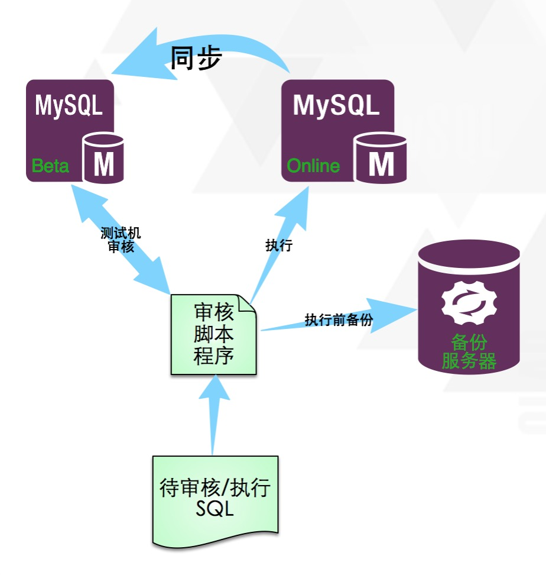
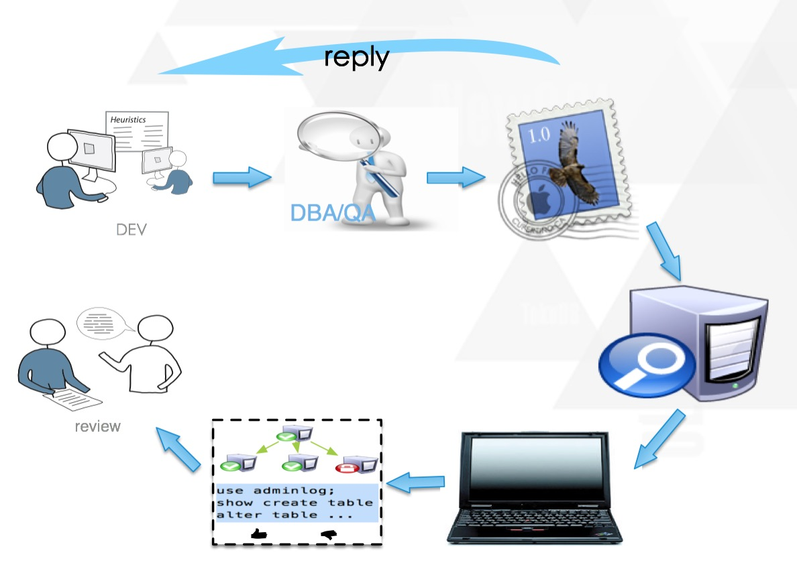

#Inception是如何诞生的
##当前审核方式对比
MySQL语句需要审核，这一点每个DBA及开发人员都懂，但介于语句及环境的复杂性，大部分人都是望而却步，对其都是采取妥协的态度，从而每个公司都有自己的方法。下面介绍两种当前能用的审核方法：
###半自动化方法
在Inception出现之前，很多公司也已经进入了审核自动化阶段，但这种自动化实际上还只能算是半自动化，因为在各个方面，其使用的友好性，审核的准确性，工作效率方面，都还是比较差强人意的，不过这已经是有了很大进步了，正所谓：It's better than nothing.  
那么半自动化方法是如何工作、实现的呢？下面先看图：

这种半自动化方法，一般包括四部分，分别是：  

* 一个很强大的审核程序  
* 线上待执行数据库服务器  
* 与线上数据库对应的Beta数据库服务器（定时与线上同步数据）  
* 执行前用来备份数据的备份服务器  

对于第一部分的审核程序，一般需要或已包括以下功能：  

* 具有简单的语法、语义检查功能，但一般情况下，都是做一些简单的匹配功能，而不是像MySQL一样，对SQL语句进行词法语法分析，做出精确的语法匹配及分析，所以这种情况下，实际上是很难做到精确审核，最简单的情况下，只是提取出SQL语句涉及到的数据库名、表名、列名及语句类型等，更深入复杂的分析很难做到。  
* 具有在提取到上面库表列等对象信息之后，还能简单通过与线上或者Beta环境对应信息的比对的功能，这样可以提前判断一些很明显的错误，这方面要尽可能的多做工作，以提高审核效率。
* 具有提前分析过滤出一些高危的SQL语句，提高审核效率的功能。比如可以提前通过在线上或者Beta数据库上执行EXPLAIN命令等方式，一方面可以检验语法及语义的正确性，另一方面，可以根据影响行数、索引使用等返回信息提前过滤出可能对数据库影响比较大，或者语法语义错误的语句，从而提高审核效率。

可以具有的功能非常多，就不一一列举了，正所谓：只有你想不到的，没有你做不到的。  
但是做再多，总是感觉走了弯路，总是力不从心，总是在不断的补洞，总是有补不完的洞，或者有些洞根本就补不上。  
实际上，从一开始，这种方式就有问题，造成程序的可维护性差，效率低下，准确性不高等等的一系列问题。

对于第二部分的线上数据库服务器，由于第一部分的审核程序有可能存在没有审核到的漏洞，一些本身存在问题的语句被认为没有问题而审核通过，这无疑给线上数据库带来了很大的风险，所以审核的准确性一定不能忽视。

对于第三部分，因为审核程序首先要在Beta环境中执行一次，如果发现没问题后，才会去线上执行，那么这个Beta就需要时刻与线上环境保持同步，数据需要一样，数据库及表的元数据必须要保证相同，这样在Beta执行才具有参照性，不然有可能在Beta不存在问题，而在线上执行就出问题了，那么这里关键的问题是如何能保持时刻同步的问题，比如一个修改比较频繁的数据库实例上面，执行过的操作发现有问题，最终没有在线上执行，那这个再有新的审核时，无效操作如何回滚，保证不影响后面的执行？在数据量很大的情况下，不管是执行或者回滚，都是问题，在数据被频繁使用过之后，有可能Beta环境需要不定时的重新做镜像，那么做一个镜像是不是还需要晚上在低峰的时候做？在高峰的时候是不是会影响线上？如此种种，实际上都是很难解决的问题，如果走了这条路，恐怕这将是DBA的又一个噩梦。

对于最后一部分，为了防止上面第三部分中执行之后（不管是线上还是Beta数据库），数据不能回滚或恢复的问题，那么最好是在执行前将要影响的数据做个备份，这样万一出问题之后，还可以及时的回滚，以尽量减少对业务的影响时间。但是这个备份说起来简单，但真正去做的时候，发现真的是没法下手，在这里可能有下面几种选择：  

* 通过审核程序想办法先查出来SQL语句将要影响的数据，生成反向的回滚语句
* 备份整个表，修改失败或者需要回滚的时候，直接使用这个备份表即可
* 利用Binlog，通过类似闪回的功能实现数据回滚

但上面的方法中，都有不同程度的复杂及不可行性，先说第一种，这种方法，审核程序需要做更多的工作，在执行前取出SQL语句将要影响的全量数据，导出来备份，然后再去修改，但这种方法存在的问题很多，首先不是所有的增删改语句都能简单的转换为一个查询语句，然后通过这个查询语句将数据导出来，其次就是准确性问题，因为数据是一直在变的，数据量大的话，花长时间导出之后，再去执行，实际上执行影响的数据已经与备份的数据不相同了，所以备份已经没有太大意义了，最后就是审核程序自己是不知道当前SQL语句具体修改了哪些数据，或者是哪些列，当数据需要恢复时，它不知道该如何恢复。  
再说第二种，很明显，这种方法对于数据量比较小的表，是可行的，因为它是某一个时刻，一个完整的备份副本。但如果数据量大一点，备份这个表的工作量是非常大的。
而对于第三种，很明显这种方法是最好的，并且也是最准确的，而一个前提是审核程序去执行的时候生成的Binlog是Row模式的。但这种方法实现起来，门槛非常高，需要全面兼容MySQL Binlog的格式，从文件中分析出数据的修改内容，同时还要在审核程序执行时，保证其执行时的thread_id及Binlog位置等信息，最后根据内容生成回滚语句。听上去非常完美，但很少人为了一个备份会去做这么复杂的工作，所以这种方式在半自动化审核中一直是没有用起来。

而在半自动化审核中，备份基本上是一个空白，因为无论对于哪种方法，都是很难实现得完美，可用。  
综上所述，可以看出半自动化方法，实际上存在很多难解的问题，不易推广，每个公司都各自为战，所以导致业界没有一个可以公用的、统一的被大家认可的审核工具。

###人肉法
在MySQL审核方法中，有一种方法是最传统，门槛最低，同时也是与半自动化方法共存的一种方法，那就是人肉法，所谓“人肉法”，就是所有的审核工作都是由人工来完成，下面先看看一般的人工审核的工作方式图：

这种方法的交流方式一般是邮件，需要执行变更时，DEV/QA写邮件向DBA发起变更，在DBA收到之后，用“火眼金睛”目测他们写的SQL是不是有问题，这里的问题要包括下面几个方面：

* 语法错误：这些错误其实真是难为我们DBA了，即使我们都是“火眼金睛”，那还是看不出来，终究不是机器人啊，比如经常有开发没有经过测试就发给DBA，会丢失分号，或者“\`”写为“'”，这可真看不出来，只有真正到线上实践后，才会发现错误。
* 语义错误：这种错误，需要DBA时刻要到线上把表结构、数据量等拿出来，然后再与SQL语句中用到的对象比对，看看SQL语句中用到的列、表、库等是不是正确，那么此时也是需要DBA的高超的目测能力（也就是我们熟知的找茬能力）的，想想在一个列名中多一个字母或者少一个字母或者空格，这能看得出来么？我想未必。
* 规则错误：我们对MySQL的SQL语句进行审核的目的就是想让SQL语句尽可能的统一，尽可能的减少错误，尽可能的优化SQL性能，尽可能的提高DBA运维效率，实际上，DBA定义了越多的规则，DBA越累，因为对所有的SQL语句，都要与我们的规则比对，找到不符合规则的语句及问题，那么这有点类似一个成语叫“作茧自缚”。DBA在每次拿到SQL语句后，心中都要遍历好多遍的“规则宝典”，在审核一个大项目之后，DBA长时间的高Load运算导致精疲力尽，同时又花了大半天的时间，也就是说DBA的大部分时间都花在了审核上面，这效率太低了，DBA的产出也太低了（但这些问题又不能不做啊）。
* 循环审核：DBA在辛辛苦苦的找到力所能找到的错误之后，发邮件给DEV，总算能休息一会儿了，同时希望这是倒数第二次审核（因为DEV再回邮件之后，一审核，哇，都改了并且没有新问题，这多好啊，所以谓之倒数第二次审核），但经常是事与愿违，这么好的DEV能有几个啊，叮咚，邮件回过来了，说一句能改的都改好了（哎，我能知道哪些是不能改的么？），DBA需要带着之前审核出来的结果，看这些有没有改好，一个个比对（不管改好没改好，都要看一遍，因为DBA也不知道他改了哪些），实际上做的是又一次完全审核，因为这存在两方面工作，一方面是审核之前提出来的问题有没有改好，第二方面是在改的过程中，有没有引入新的问题。从上面的过程可以知道，DBA在这方面的工作量是非常大的，工作时间也基本都花在这上面，效率低下。
* 主观性：对于已经定义的规则，虽然明明白白写在那里，但不同的DBA对同一条规则的理解其实是不同的，所以存在宽松不均的问题，同一个开发，面对不同DBA时，有时很轻松的通过，但有时又是铁律，搞得DEV/QA摸不着头脑，最终导致规则不成规则，很难推行下去。
* 执行前检查：在上面久经折腾之后，好不容易审核通过了，可以执行了，那现在DBA需要做的事情是先对线上环境做一次检查，比如DEV写得IP是读库的虚IP还是写库的，执行语句时对线上的影响多大，对于DML语句，如果影响行数太多，可能还需要拆开再去执行，而如果是DDL，可能需要考虑晚上再去执行，或者用OSC（pt-online-schema-change）工具来执行等等。这些问题确定之后，再考虑开始执行。
* 执行前备份：备份是必要的，因为语句在没有执行时，都是想不到他有影响会有多大，一般是不需要，而需要时，才知道备份是多么的重要，这也正是应了一句谚语：“书到用时方恨少；事非经过不知难。”，但这个工作也很是让人为难，应该备份全表呢？还是把影响的查出来备份呢？DBA在这个时候肯定是很不愿意这样做，但万一出问题怎么办？都懂得，不说了。
* 执行出错：终于到执行阶段了，可是万万没想到，执行出错了，比较多的是语法/语义错误，此时可能要与DEV沟通，为什么发起时没有测试，通常他们会告诉你，测试过了，但贴到邮件时贴错了，此时DBA可能需要手动一个一个把出现错误的地方修改过来再执行，而需要注意的是，出现之前的那些语句已经执行完了，需要把那些语句去掉，而如果这样的问题在一次执行中出现多次的话，执行过程也会耗费掉不少时间。
* 执行后检查：这个工作一般就是DEV/QA的事情了，DBA在执行完后，通知执行完成，并做检查，之后DBA的事情是等待（类似信号等待），或者可以切换到其它线程去处理其它数据变更请求。当DEV/QA告诉你检查没事儿了，这个事儿才算结束。

一个DBA一天的时间往往都被这些不想做而必须要去做的事情困扰着，同时DB组还发现人力根本不够，还需要招人（难道招人来了还是去干这些事情么？），DBA难道就是只干这些事情的人么？不是！！！

DBA苦审核久矣！

##做DBA不久后的思考
在做一段时间DBA之后，发现DBA的工作根本苦水堪言，基本所有时间都被这些繁冗的事情困扰着，根本没有多余时间去做一些更高大上的工作，比如读读源码等。

后来听说一些大公司，都有一些自动化审核工具，此时我如拨云雾而见青天，心想现在不正是自动化运维所兴起的时代么，这种工作完全可以由自动化工具所代替，想到这里不由得感到一种兴奋。

后来就开始调研他们的审核工具的实现方式，但后来发现，基本都是上面提到的半自动化实现方法，感觉总是不怎么理想，DBA的负担还是非常重，想着如何能优化，或者有一种更好的方案。

忽然有一天，我正在审核一堆的建表语句，因为要有一个大项目上线，我已经心力交瘁了，突然一个念头，MySQL可以执行任何提交给他的MySQL SQL语句，并且如果存在任何问题，都会提前报出来，为什么？不就是因为它支持么（好像是废话），但关键问题就是在这里，MySQL可以执行那些SQL语句，那么是不是可以搞一个和MySQL完全兼容的东西，去审核这些SQL语句呢？或者说，我如果把MySQL切隔改造，让它不去执行，而是分析之后，找出存在问题的地方，这样不就解决了审核准确的第一难题了么？想到这里，一股暖流流过心头，那时，好像在远方的某个地方，看到了希望之火——哦，那是太阳！

现在，终于，Inception从此诞生了，它是关于DBA的一个美好的故事。

