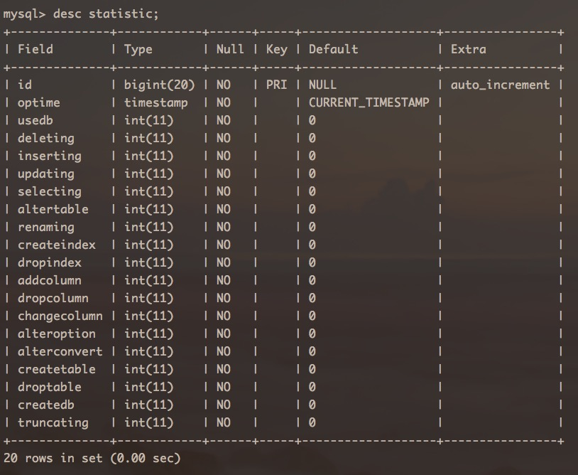

#Inception 的统计功能
在使用了Inception之后，数据变更已经全面进入全自动化模式，有了这个利器之后，一些以往想做而做不成的事情，现在可以做了，比如对SQL执行情况的统计，修改表的语句究竟占多大的比例，或者数据变更占多大比例，那么使用Inception，这个事情就轻而易举了，并且非常准确。

SQL统计功能涉及到的参数为： **inception_enable_sql_statistic**, 这个参数在前面的<<**Inception所支持的参数变量**>>一章中已经介绍过，那么这里主要说一下它的使用方法。

除了上面的参数之外，使用这个功能还需要开启操作备份功能，因为这些统计数据需要存储到备份数据库中，存储的数据库名为**inception**中，这个数据库主要是用来存储Inception的一些统计信息的，现在只有一个表**statistic**，这个表存储的就是SQL执行数目的统计数据，而以后有可能还会做一些扩展而新生成一些表。

**statistic**表的结构如下：


从每一个列的名字就可以看到，其值对应的操作是什么，每一个列就是一个自增列，第二个列optime是操作时间，这个主要是用来统计在某一段时间内的某一个操作占多少比例。

下面解释一下有些不太明确的列的意义：  
**deleting**:包括普通的删除操作及多表删除操作。  
**inserting**:包括单行插入、多行插入及查询插入。  
**updating**:包括普通单表更新及多表的更新。  
**renaming**:指的是ALTER table语句中的rename操作。  
**createindex**:指的是ALTER table语句中的add index操作。  
**dropindex**:指的是ALTER table语句中的drop index操作。  
**alteroption**:指的是ALTER table语句中的修改表属性的操作，比如存储引擎、自增值及字符集中操作。  
**alterconvert**:指的是ALTER table语句中修改表字符集的操作。  

对于ALTER TABLE操作，因为这个操作包含很多的子操作，比如rename、drop index、engine innodb等操作，所以对于列altertable，它的值是renaming, createindex, dropindex, addcolumn, dropcolumn, changecolumn, alteroption, alterconvert的和, 而后面的是对ALTER TABLE语句的细分操作统计。

那么如果现在想要统计某一个操作，比如修改表占所有操作的百分比，则使用如下语句即可完成：
````
select sum(a.oprate)/count(1) updaterate from 
(select (updating)/(usedb+deleting+inserting+updating+selecting+altertable+ 
createtable+droptable+createdb+truncating) oprate from 
inception.statistic) a;
````

#需要注意的问题
因为Inception的审核、执行及备份是分阶段的，只有前面的阶段执行成功之后，才能进入下一个步骤，那么针对一块语句的操作统计，只有在开始备份时才会将统计信息存储起来，那么当前面执行、审核有问题导致提前返回时，统计是不是会被更新的，只有成功执行了，才会被记录下来。而如果是后面备份时出错导致提前返回，那么统计信息是被成功存储的。


